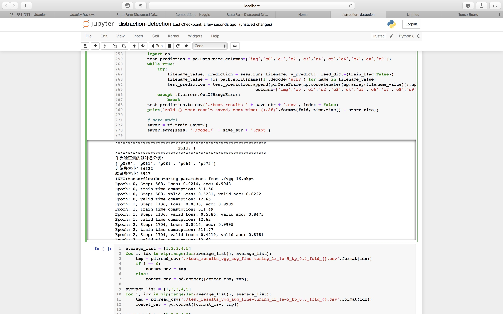
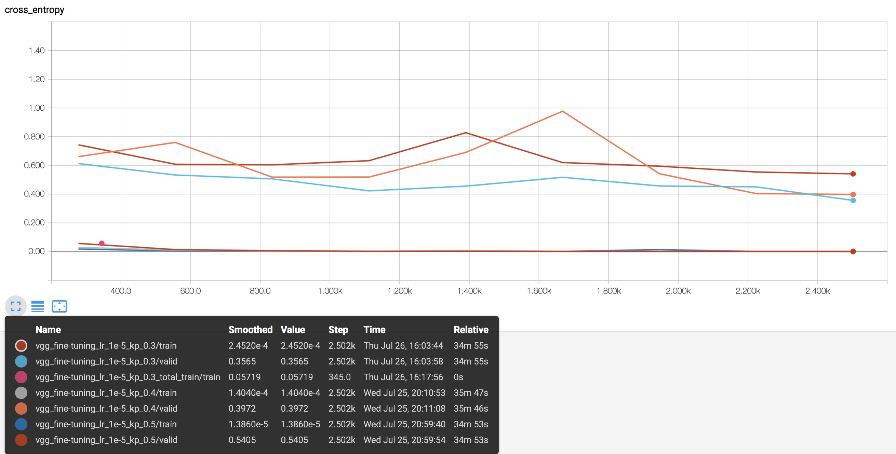

# 实验环境

- CPU：Intel i7-6850K
- 内存：32GB
- 显卡：Nvidia GTX-1080Ti
- 操作系统：Ubuntu 16.04
- Python版本：Python 3.5
- 库
  - numpy 1.14.3
  - tensorflow 1.8.0
  - keras 2.1.6
  - cv2 3.4.0
  - pandas 0.23.0
  - sklearn 0.19.1
  - pickle
  - time
  - random
  - matplotlib 2.2.2
  - PIL 5.1.0
  - multiprocessing
  - glob
  - os

# 额外支持材料

本项目中对数据集进行了增广，增广后的数据集太大，暂时无法上传。但是，增广数据集的程序在jupyter notebook中已经给出，同时在报告中也给出了部分样例。

由于涉及实验较多，tensorboard的记录文件较大，暂时无法上传。但是在报告中给出了主要结果可视化的截图。

fine-tuning后的VGG模型文件也较大，暂时无法上传。

# 代码运行

对于基准神经网络，在原始数据集上，按照训练/测试集划分，训练集上一个epoch的运行时间约为18秒。

对于VGG-16迁移学习，在原始数据集上，按照训练/测试集划分，训练集上一个epoch的运行时间约为248秒。

对于VGG-16迁移学习，在增广的数据集上，按照训练/验证集划分，训练集上一个epoch的运行时间约为511秒。

代码运行情况在jupyter notebook中给出，这里给出部分截图。

另外，报告中也给出了部分运行结果在tensorboard中可视化的截图。例如

