# 走神司机检测

## I. 问题的定义

### 项目概述

驾驶员⾛神是导致交通事故的⼀个很重要的原因。根据美国疾病控制和预防中⼼汽⻋安全部⻔的数据，每5起交通事故中就有1起是由驾驶员⾛神引起的，由此导致每年有425,000⼈受伤、3,000⼈死亡 （信息来源：竞赛简介）。诚然，⾃动驾驶技术的发展能够消除驾驶员⾛神带来的影响，但是在可预⻅的将来，仍将有很⼤⼀部分⻋辆依赖⼈类驾驶。因此，如果能够提前判断驾驶员是否⾛神并作出及 时提醒，很多的事故是可以避免发⽣的。在现有的⽂献中，⼀些学者关注了这个问题，并从运动检测 （例如[Detecting and mitigating driver distraction with motion capture technology: Distracted driving warning system][https://ieeexplore.ieee.org/abstract/document/6549497/]）等⻆度进⾏了⾛神检测的研究。但是，⾛神⽅式很多样，其带来的影响也是不⼀样的。例如，和乘客聊天时，驾驶员的感知注意⼒仍然能够较⼤程度地集中在路况上；但是低头找东⻄时，驾驶员就会失去对路况的有效感知。⽬前的研究中较少有⾛神⽅式的检测或者从语义⻆度理解⾛神⾏为。

精细化检测⾛神⾏为，不仅提示是否⾛神，同时预测⾛神的⽅式（例如，与乘客交谈或使用手机），能够有效帮助⾼级辅助驾驶系统根据不同的危险等级作出相应提醒甚⾄主动⼲预。深度学习的发展，为机器理解图像提供了⼀个强有⼒的⼯具，机器能够更精确同时更精细地对图像中的内容作出分类，机器也能够从语义⻆度理解图像。 因此，将深度学习应⽤到驾驶员⾛神⾏为检测中，是具有很好的实践意义的。Kaggle中的State Farm Distracted Driver Detection，提供了一个良好的数据集。

### 问题陈述
本项⽬中利⽤深度学习训练应⽤于驾驶员⾛神检测的多分类器。分类器的输⼊为⻋内摄像头拍摄的驾驶员画⾯，输出为⼗种⾛神状态的概率值。这样的问题，在数据集充分的情况下，在原理上与常⻅的图像分类任务（例如ImageNet）是⽐较相似的。

其中，⼗种可能的⾛神状态定义为：

C0: 安全驾驶 C1: 右⼿打字 C2: 右⼿打电话 C3: 左⼿打字 C4: 左⼿打电话 C5: 调收⾳机 C6: 喝饮料 C7: 拿后⾯的东⻄ C8: 整理头发和化妆 C9: 和其他乘客说话

解决问题的思路：

1. 需要对数据集进⾏探索，通过随机采样可视化等⽅式对数据集中的数据有⼀个直观的认识；同时对于类别信息进⾏统计，查看类别是否均衡，是否需要数据增⼴等。 
2. 对图像进⾏裁剪、归⼀化等预处理操作。 
3. 考虑到图像采集时具有时序关系，同一驾驶员的数据相关性较强，对于训练集按驾驶员分类，随机打乱，并划分训练集、验证集。 
4. 对于较⼤的训练集等，可抽取一部分作为小训练集，便于验证模型正确运行。 
5. 构造简单卷积神经⽹络（例如三层卷积池化层+三层全连接层），在小训练集上调试超参数。 可以使⽤batch normalization等⽅式加快⽹络训练。可以使⽤tensorboard对⽹络结构和训练过程进⾏可视化。可以通过k-折交叉验证、⽹格搜索等⽅式进⾏超参数选择。 
6. 将简单卷积神经⽹络在全部训练集上训练，并微调超参数。
7.  利⽤迁移学习的⽅式，使⽤多种在ImageNet上取得良好效果的⽹络结构，并在此基础上添加新的卷积或全连接层，进行fine-tuning，在小训练集上调试超参数。可以使⽤batch normalization等⽅式加快⽹络训练。可以使⽤tensorboard对⽹络结构和训练过程进⾏可视化。可以通过k-折交叉验证、⽹格搜索等⽅式进⾏超参数选择。将上述训练后的迁移学习模型在全部训练集上进⾏训练，微调超参数。并将训练后的模型与基准模型进⾏性能对⽐。
8.  可以将多个迁移学习模型（例如基于不同的经典⽹络结构VGG、ResNet等）进⾏集成。

预期目标：训练的多分类器能够较好地预测走神行为，预测的类别与实际吻合，同时输出的类别属性概率较大，即输出层的类别神经元的输出较大。

### 评价指标
评估指标采用验证集上的多类交叉熵均值。每个样本都对应着一个长度为10的输出向量，其中的每一个元素对应了其属于该类的概率；每一个样本也对应着一个真实标签，真实标签用one-hot表示也是长度为10 的向量。通过交叉熵可以衡量这两个向量之间的差异，交叉熵越小，向量越相似，说明预测的越准确。

对于整个验证集，假设有N个样本，则评估指标可以表示为$-\sum_{i=1}^N\sum_{j=1}^{10}y_{ij}\log p_{ij}$，其中$y_i = [y_{i1}, ..., y_{i10}]^T$和$p_i=[p_{i1}, ..., p_{i10}]^T$分别是第i个样本的one-hot真实标签向量和概率输出向量。


## II. 分析
### 数据的探索、探索性可视化


数据集是通过车内的摄像头获得的，数据已按训练集和测试集划分。训练集总计22,424张图像，分属于C0～C9的十个场景类别。十个类别的图像分别有2490, 2268, 2318, 2347, 2327, 2313, 2326, 2003, 1912, 2130张，从数量上看类别比较均衡。driver_imgs_list.csv给出了所有训练集图像的文件名及对应的类别标签、驾驶员标签。虽然每一张图像都只对应一个行为标签，但需要注意的是有的图像的行为实际上覆盖了多种行为，这可能会对分类产生干扰。例如，对于右手打字的类别（C1），图片img_1472是比较标准的样本，同时驾驶员也目视前方。


但是，同属于右手打字类别，图片img_2298实际上还存在着很明显的和乘客说话的行为。


而在和乘客说话的类别（C9）里，又存在图片img_523，看起来和正常驾驶行为很相近


这些样本都会对分类器的判断产生影响。同时，训练集较小，存在过拟合的风险。可能需要进一步筛选训练集和数据增广。

图片尺寸为640*480，与常规的模型输入尺寸不一致（例如，VGG为224\*224），需要重新调整尺寸，可以利用opencv中的resize函数。

测试集总计79,726张图像。

在训练中，数据集可以将训练集进一步划分为训练集、验证集，图像作为输入进入到深度神经网络中，输出十个类别的概率，并根据对应的真实标签进行迭代优化。

进一步，我们可以发现训练集本身相对于测试集较小（22,424 vs 79,726）。同时训练集中存在许多极其相似的图像，如下图（img_231.jpg vs img_414.jpg），这是因为数据是从连续的视频中获得，这些数据是冗余的，相关的，不满足独立同分布假设。


这种情况下，十分容易出现过拟合，这在后续实验中得到验证。因此，一方面，我们需要按照驾驶员来划分训练集和验证集，因此如果随机打乱划分，那么验证集中的每一张图像都很有可能在训练集中找到时序相关、极其相似的图像，这样的验证集不能表征算法的性能。

另一方面，“剔除”掉冗余信息，训练集的信息量十分有限。任务复杂度，网络复杂度和数据信息量，三者需要良好的匹配才能实现较好的性能。因此，需要进行数据增广。数据增广参考[合成图像](https://www.kaggle.com/c/state-farm-distracted-driver-detection/discussion/22627)，针对数据集中的每一张图片，保持驾驶员标签不变（这张图片在合成图片中占比较大，便于后续按驾驶员标签划分训练、验证集），选取右边部分（横向坐标400:640），然后在同一走神行为类别下随机选取另一张图片（为增强多样性，不选择同一驾驶员标签），选取其左边部分（横向坐标0:240），左右拼接成新图。通过1个epoch的数据增广，总计获得22,424 * (1 + 1) = 44，848张图像。统计可得，训练集司机人数为26，训练集行为类别数为10。

对于训练集，统计不同驾驶员的样本个数，绘制直方图如下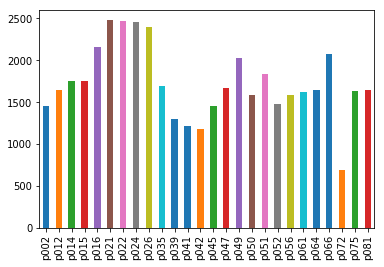


可以看到，样本在不同驾驶员之间的分布不是十分均衡，尤其是p072，数据量只有最多的p021的五分之一，这在按照驾驶员划分训练集验证集时是有一定影响的。

统计不同类别的样本个数，绘制直方图如下

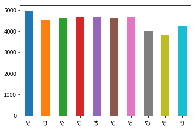

可以看到，不同类别间的数据分布还是比较均匀的。进一步，我们可以观察不同驾驶员在不同标签下的数据分布

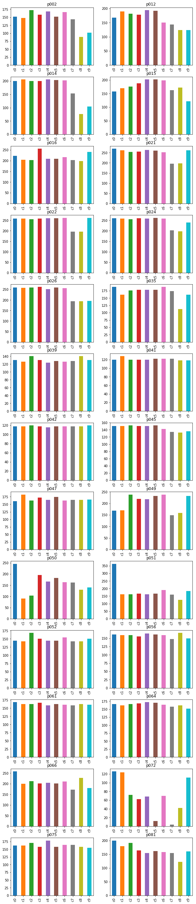

可以看到，总体上不同驾驶员、不同标签的数据分布是比较均衡的，但是p051的数据中c0标签较多，不够平衡；p072的数据中，标签之间很不平衡。当按照驾驶员划分训练、验证集时，这些都是很不利的，因此需要处理。

数据增广后的部分样本如下

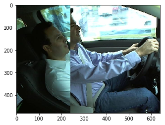


可以看到，能够辨认驾驶员的走神行为，但是驾驶员本身的特征引入了噪声，可以使网络不关注于驾驶员本身的特征，降低过拟合的风险。

### 算法和技术
首先，这是图像多分类问题。问题复杂度、数据信息量和模型复杂度，三者相互匹配，才能够得到良好的性能。对于这类图像多分类问题，问题是相对复杂的，不能通过简单的例如线性方法进行分类，可以优先考虑较复杂的神经网络，但是相应地要增加数据集的信息量。

通过数据探索可知，数据是从视频信号中采集而来，同一个驾驶员、同一个标签的样本通常具有很强的时序相关性。一方面，我们可以认为这破坏了独立同分布的数据假设；另一方面，我们可以认为原始数据集中信息是冗余的，重复的，如果剔除这些冗余信息，数据集将进一步严重减小；同时，同一类别中，大量相似的样本会对训练造成干扰，诱导网络记住相同的驾驶员，而不是标签对应的行为。为了解决这一问题，一方面，我们可以按照驾驶员进行训练、验证集划分，这样可以打破训练、验证集的相关性；另一方面，我们可以进行数据增广，扩充原始数据集的信息量，添加噪声，防止过拟合。

**卷积神经网络**

对于图像分类，卷积神经网络是一种十分有效的技术。卷积神经网络的核心是卷积层。

**卷积**。卷积层通过对原始图像滑动应用卷积核的卷积操作，类似于模板匹配的思想，实现特征的提取。卷积操作一方面利用了图像的二维平面结构，通过卷积核的参数实现了权值共享，减少了参数数量；另一方面，能够提取线条等简单特征，为后续网络层的复杂特征提取奠定基础。通过多层卷积层的叠加，简单特征可以非线性组合成复杂特征，这体现了特征层次化的特点，是深度学习发展的基础。卷积操作示意图如下（[出处](https://blog.csdn.net/zouxy09/article/details/49080029)）

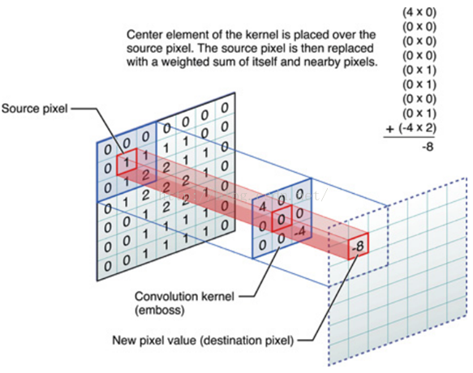

**池化**。通过池化操作，一方面可以压缩数据的表示，便于数值计算及优化；另一方面，使得网络在图像的某一局部小区域不再关注每一个像素点，而是关注这个区域的总体特征，一些噪声可以被过滤，网络防止过拟合的能力有所提升。

**Dropout**。为了进一步防止过拟合，一个有效的手段是dropout，通过在训练中随机丢弃一些节点，能够添加训练噪声，迫使网络学习更加分散、泛化能力更强的表达。Dropout示意图如下[4]

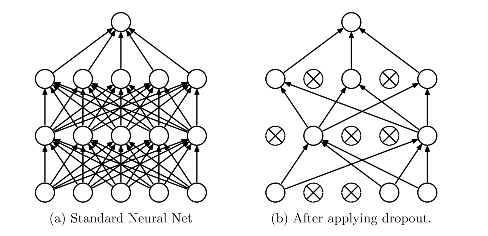

**典型结构**。可以首先搭建简单的卷积神经网络，采用两层卷积层，每层之后加最大池化（pool_size=2, strides=2），每层卷积核个数分别为64，128，卷积核大小分别为3，3，stride为2，2。之后，添加展开层和两层全连接层，神经元个数分别为100，10；在每一层全连接层前添加dropout层，防止过拟合；最后为softmax层。这样的思想，与VGG [1]是类似的，但是网络层级较少，参数较小，比较简单，便于验证处理流程的正确性。在这个网络中，进行超参数调整，可以获得一个较低的性能参考值。

**迁移学习**

在此基础上，考虑到数据集大小仍不足以支撑较大的网络训练，而较大的网络又是这个问题的复杂度要求的，因此可以采用迁移学习。迁移学习，是将一个在现有任务上训练好的模型应用到新的任务上，需要考虑任务相似性和数据量大小。在合理的情况下，迁移学习不仅提供了一个较为合理的网络架构设计，同时也为网络训练提供了很好的初始条件，大大降低了训练的难度。使用在ImageNet上训练的VGG等模型，将输出层去除，添加新的全连接层作为输出层，进行fine-tuning分类训练。

VGG网络的典型结构如图（[出处](https://www.google.com/url?sa=i&rct=j&q=&esrc=s&source=images&cd=&cad=rja&uact=8&ved=2ahUKEwj2g_eys9jcAhUXFTQIHZg1CnwQjRx6BAgBEAU&url=https%3A%2F%2Fwww.researchgate.net%2Ffigure%2FVGG16-architecture-16_fig2_321829624&psig=AOvVaw0BaxlYePOwqEPoTUIozopG&ust=1533643897280964)）：

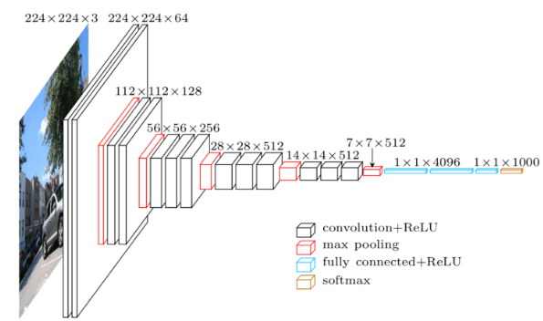

可以看到，以VGG为代表的一系列经典的卷积神经网络结构由一些共同的特点，就是首先通过多层的卷积（池化）层提取图像的二维结构特征，同时随着网络层次加深，将简单特征加以组合，形成复杂特征，最后通过全连接层与输出层各单元连接，针对不同类别标签形成对应的激活路径。

**集成学习**

可以采用交叉验证的方式，进行网络超参数的寻优。针对一组超参数或一组预训练模型，可以在交叉验证不同的分折训练集上训练，得到一组模型，通过Bagging集成学习的方式进行综合。Bagging集成学习，能够将多个相互独立的弱学习器组合成强学习器。由于训练集、网络结构等的不同，弱学习器可能分别收到不同的样本扰动干扰，但是将它们组合，通过投票、平均等方式，能够降低这种扰动的影响，提升其泛化能力。

实际上，dropout的抑制过拟合能力也可以从Bagging的角度解释，相当于把一系列部分激活的网络组合起来。

**优化器**

优化器采用Adam优化器，其优点主要是能够自适应调整学习率，同时结合了 AdaGrad 和 RMSProp 算法的有点，超参数鲁棒性较好。


### 基准模型
这里是多分类问题，可以通过比较多类交叉熵来比较模型之间的性能差异。初步拟定基准阈值为 kaggle 排行榜前 15%，也就是在 Private Leaderboard 上的 logloss 要低于 0.32701。


## III. 方法
### 数据预处理
在简单CNN中，图像输入除以255，进行归一化。在VGG中，图像输入除以三通道的均值[123.68, 116.78, 103.94]。

数据探索中，p051的c0类随机剔除一半，保证类别均衡。p072整体剔除，以免影响数据分布。

数据增广部分上文已经给出，在此不再赘述。

预处理中没有转换RGB通道的顺序，因为这里采用的是tensorflow.contrib.slim中的VGG模型，其输入本身是按RGB顺序给出，具体可参考slim[代码1](https://github.com/tensorflow/tensorflow/blob/e7475504094b3018973740df470d2c9ee73a4fd5/tensorflow/contrib/slim/python/slim/nets/vgg.py#L139)和[代码2](https://github.com/tensorflow/models/blob/22e248cebd6a556594f5631f5213bf13fd6f5792/research/slim/preprocessing/vgg_preprocessing.py#L316)。

### 执行过程
#### 数据增广

对于数据增广，利用了python的PIL库进行图片的变换。

#### 数据探索、分析、整理

数据的探索、分析和整理，主要是通过pandas、matplotlib和numpy库实现的。

#### 神经网络

对于神经网络的搭建和训练、以及训练结果可视化，主要是利用TensorFlow框架。

##### 数据输入

在数据输入方面，采用了Dataset API。首先构造dataset，例如从上述处理后的训练样本train_sample和训练标签train_label生成train_dataset，并随机打乱。

```python
train_dataset = tf.data.Dataset.from_tensor_slices((train_sample, train_label))
train_dataset = train_dataset.shuffle(buffer_size=len(train))
```

此时，train_dataset中的每个元素是(sample, label)，其中sample是图片的文件名，图片数据本身并没有读入。因此，需要构造读取函数，并传入dataset中

```python
def _parse_function(filename, label):
    image_string = tf.read_file(filename)
    image = tf.image.decode_jpeg(image_string,3) # RGB mode
    image = tf.image.resize_images(image, [224, 224])
    means = tf.expand_dims(tf.expand_dims(_CHANNEL_MEANS, 0), 0)
    image -= means # zero center，针对VGG
#     image = image / 255. # 归一化,针对基准神经网络
    return filename, image, label

train_dataset = train_dataset.map(_parse_function, num_parallel_calls=12)
```

此时，train_dataset中的每个元素是(sample, image,  label)。在该函数中，图像被读入，并重新调整大小，并进行零中心或归一化操作。num_parallel_calls=12表示同时有12个进程进行读取处理。

```python
train_dataset = train_dataset.batch(64)
train_dataset = train_dataset.prefetch(1)

iterator = tf.data.Iterator.from_structure(train_dataset.output_types,
                                               train_dataset.output_shapes)
train_iterator_op = iterator.make_initializer(train_dataset)
```

对于mini-batch，batch size取为64，同时开启预读取。最后构造迭代器和迭代器初始化操作符。

##### 基准神经网络

基准神经网络，如上所述，采用两层卷积层，每层之后加最大池化（pool_size=2, strides=2），每层卷积核个数分别为64，128，卷积核大小分别为3，3，stride为2，2。之后，添加展开层和两层全连接层，神经元个数分别为100，10；最后为softmax层。

在TensorFlow中构建计算图如下：

```python
train_flag = tf.placeholder(tf.bool, shape=(), name="train_flag")

filename, x, y = iterator.get_next()

image_summary_op = tf.summary.image('input', x,10)

# conv 1
Conv1 = tf.layers.Conv2D(
        filters=64,
        kernel_size=3,
        strides=(3, 3),
        name='conv1'
        )

# pooling 1
Pooling1 = tf.layers.MaxPooling2D(
        pool_size=2,
        strides=2,
    	name='pooling1'
    )

# conv 2
Conv2 = tf.layers.Conv2D(
        filters=128,
        kernel_size=3,
        strides=(3, 3),
        name='conv2'
        )

# pooling 2
Pooling2 = tf.layers.MaxPooling2D(
        pool_size=2,
        strides=2,
        name='pooling2'
    )

# flatten
Flatten1 = tf.layers.Flatten(name='flatten')

# dropout1
Dropout1 = tf.layers.Dropout(name='dropout1')

# dense 1
Dense1 = tf.layers.Dense(
        units=100,
        activation=tf.nn.relu,
        name='dense1'
        )

# dropout2
Dropout2 = tf.layers.Dropout(name='dropout2')

# output
Output = tf.layers.Dense(
        units=10,
        activation=None,
        name='output'
        )

# network pipeline
x = Conv1(x)
x = Pooling1(x)
# relu 1
x = tf.nn.relu(x, name='relu1')
x = Conv2(x)
x = Pooling2(x)
# relu 2
x = tf.nn.relu(x, name='relu2')
x = Flatten1(x)
x = Dropout1(x, training=train_flag)
x = Dense1(x)
x = Dropout2(x, training=train_flag)
y_hat = Output(x)
y_predict = tf.nn.softmax(y_hat)

# summary merged, loss and acc not included
merged = tf.summary.merge_all()

# loss
loss = tf.reduce_mean(tf.nn.softmax_cross_entropy_with_logits(labels=y, logits=y_hat))
loss_placeholder = tf.placeholder(tf.float32,shape=(), name='loss')
loss_summary_op = tf.summary.scalar('cross_entropy', loss_placeholder)

# train op
global_step = tf.Variable(0, name='global_step', trainable=False)
optimizer = tf.train.AdamOptimizer(
                learning_rate=0.0001,
                name='Adam'
            )
train_op = optimizer.minimize(loss, global_step)

# get accuracy
predict = tf.argmax(y_hat, 1)
equal = tf.equal(predict, tf.argmax(y, 1))
acc = tf.reduce_mean(tf.cast(equal, tf.float32))
acc_placeholder = tf.placeholder(tf.float32,shape=(), name='acc')
acc_summary_op = tf.summary.scalar('accuracy', acc_placeholder)

# 初始化变量
init_op = tf.global_variables_initializer()
```

基准神经网络的训练代码如下

```python
# 训练基准神经网络
import time
config = tf.ConfigProto()
config.gpu_options.allow_growth = True
with tf.Session(config=config) as sess:
    sess.run(init_op)
 
    log_path = './log/baseline'
    if tf.gfile.Exists(log_path):
        tf.gfile.DeleteRecursively(log_path)
    tf.gfile.MakeDirs(log_path)
    train_writer = tf.summary.FileWriter(log_path+'/train', sess.graph)
    valid_writer = tf.summary.FileWriter(log_path+'/valid')

    EPOCHES = 15
    for epoch in range(EPOCHES):
        start_time = time.time()
        sess.run(train_iterator_op)
#     sess.run(small_train_iterator_op)

        # training for one epoch
        while True:
            try:
                sess.run(train_op, feed_dict={train_flag:True})
            except tf.errors.OutOfRangeError:
                break
        
        # summary weights
        step = sess.run(global_step)
        sess.run(train_iterator_op)
        merged_summary = sess.run(merged)
        train_writer.add_summary(merged_summary, step)  
        
        # For each epoch, calculate the loss and acc over entire train set
        sess.run(train_iterator_op)
        train_batch = 0
        total_loss = 0
        total_acc = 0
        while True:
            try:
                loss_value, acc_value = sess.run([loss, acc], feed_dict={train_flag:False})
                train_batch += 1
                total_loss += loss_value
                total_acc += acc_value
            except tf.errors.OutOfRangeError:
                break
        cross_entropy_value = total_loss / train_batch
        acc_value = total_acc / train_batch
        print("Epoch: {}, Step: {}, Loss: {:.4f}, acc: {:.4f}".format(epoch, step, cross_entropy_value, acc_value))
        sess.run(train_iterator_op) # actually no use, but avoid the tf.errors.OutOfRangeError when running the next line
        loss_summary, acc_summary = sess.run([loss_summary_op, acc_summary_op], feed_dict={loss_placeholder: cross_entropy_value, acc_placeholder:acc_value})
        train_writer.add_summary(loss_summary, step)
        train_writer.add_summary(acc_summary, step)
        end_time = time.time()
        print("Epoch: {}, train time comsuption: {}".format(epoch, end_time-start_time))
        
        # for each epoch, summary the loss and acc over entire valid set
        start_time = time.time()
        sess.run(valid_iterator_op)
        valid_batch = 0
        total_loss = 0
        total_acc = 0
        image_summary = sess.run(image_summary_op)
        valid_writer.add_summary(image_summary, step)
        while True:
            try:
                loss_value, acc_value = sess.run([loss, acc], feed_dict={train_flag:False})
                valid_batch += 1
                total_loss += loss_value
                total_acc += acc_value
            except tf.errors.OutOfRangeError:
                break 
        cross_entropy_value = total_loss / valid_batch
        acc_value = total_acc / valid_batch
        print("Epoch: {}, Step: {}, valid Loss: {:.4f}, valid acc: {:.4f}".format(epoch, step, cross_entropy_value, acc_value))
        sess.run(valid_iterator_op) # actually no use, but avoid the tf.errors.OutOfRangeError when running the next line
        loss_summary, acc_summary = sess.run([loss_summary_op, acc_summary_op], feed_dict={loss_placeholder: cross_entropy_value, acc_placeholder:acc_value})
        valid_writer.add_summary(loss_summary, step)
        valid_writer.add_summary(acc_summary, step)
        
        end_time = time.time()
        print("Epoch: {}, valid time comsuption: {}".format(epoch, end_time-start_time))
    
    
    sess.run(test_iterator_op)
    import os
    test_prediction = pd.DataFrame(columns=['img','c0','c1','c2','c3','c4','c5','c6','c7','c8','c9'])
    while True:
        try:
            filename_value, prediction = sess.run([filename, y_predict], feed_dict={train_flag:False})
            filename_value = [os.path.split(name)[1].decode('utf8') for name in filename_value]            
            test_prediction = test_prediction.append(pd.DataFrame(np.concatenate((np.array(filename_value)[:,np.newaxis], prediction), axis=1),
                                               columns=['img','c0','c1','c2','c3','c4','c5','c6','c7','c8','c9']))
        except tf.errors.OutOfRangeError:
            break
    test_prediction.to_csv('./test_results.csv', index = False)
    print("test result saved")
```

为了观察大致性能和趋势，并节省计算时间，这里没有采用k折交叉验证，而是按照驾驶员标签随机选取了一组训练集/验证集划分。总计训练15个epoch，每个epoch结束时，都计算在整个训练集、验证集上的损失和精度，并利用tensorboard进行记录。最后在整个测试集上预测标签，并保存。（理论上，通过训练集、验证集上的性能筛选模型后，应该在整个训练集（包含训练集、验证集）上重新训练，但这里作为简单基准和初步分析，暂时省略这一步骤）。

以此基准神经网络为基础，可以调整学习率、dropout的保留率等超参数，并通过在训练/验证集上的性能进行模型的比较，确定一个比较容易达到的基准性能。但是，这个基准神经网络的性能很可能达不到基准阈值（ kaggle 排行榜前 10%，也就是在 Private Leaderboard 上的 logloss 要低于 0.25634）。因为问题具有一定的复杂度，但数据集很小并且有冗余信息。此时，如果模型过小，则容易欠拟合；模型过大，容易过拟合。基准神经网络从零开始训练，相对这个数据集可能过大，容易学习到错误的特征，“记住”训练集，有过拟合的风险。一种方式是通过迁移学习，利用预训练模型参数，进行fine-tuning。

#### VGG迁移学习

迁移学习，利用在其他任务（如ImageNet）上训练成熟的模型，进行新任务的训练。这里，主要是利用VGG-16模型，利用其预训练的参数，进行fine-tuning。

构建计算图如下

```python
# transfer learning
# fine-tune VGG
train_flag = tf.placeholder(tf.bool, shape=(), name="train_flag")

filename, x, y = iterator.get_next()

image_summary_op = tf.summary.image('input', x,10)

# vgg with fc8 modified
vgg = slim.nets.vgg
with slim.arg_scope(vgg.vgg_arg_scope()):
    y_hat, _ = vgg.vgg_16(x, is_training=train_flag, dropout_keep_prob =0.4, num_classes=10)

variables_to_restore = slim.get_variables_to_restore(exclude=["vgg_16/fc8"])
fc8_variables = tf.contrib.framework.get_variables('vgg_16/fc8')

y_predict = tf.nn.softmax(y_hat)

# summary merged, loss and acc not included
merged = tf.summary.merge_all()

# loss
loss = tf.reduce_mean(tf.nn.softmax_cross_entropy_with_logits(labels=y, logits=y_hat))
loss_placeholder = tf.placeholder(tf.float32,shape=(), name='loss')
loss_summary_op = tf.summary.scalar('cross_entropy', loss_placeholder)

# train op
global_step = tf.Variable(0, name='global_step', trainable=False)
# global_step = tf.get_variable(name='global_step', initializer=tf.constant_initializer(0),shape=[], trainable=False)
optimizer = tf.train.AdamOptimizer(
                learning_rate=1e-5,
                name='Adam'
            )
# # only train fc8 layer
# train_op = optimizer.minimize(loss, var_list=fc8_variables, global_step=global_step)
# fine-tune all layers
train_op = optimizer.minimize(loss, global_step=global_step)

# get accuracy
predict = tf.argmax(y_hat, 1)
equal = tf.equal(predict, tf.argmax(y, 1))
acc = tf.reduce_mean(tf.cast(equal, tf.float32))
acc_placeholder = tf.placeholder(tf.float32,shape=(), name='acc')
acc_summary_op = tf.summary.scalar('accuracy', acc_placeholder)

# 初始化，fc8_init
model_path = './vgg_16.ckpt'
init_fn = tf.contrib.framework.assign_from_checkpoint_fn(model_path, variables_to_restore)
fc8_init = tf.variables_initializer(fc8_variables)
```

这里，VGG模型主要是通过tf.contrib.slim来实现，预训练的参数通过tf.contrib.framework.assign_from_checkpoint_fn来实现。

在某个训练集/验证集划分上的训练代码如下

```python
# fine-tune VGG
# train on train/valid split
import time
config = tf.ConfigProto()
config.gpu_options.allow_growth = True
with tf.Session(config=config) as sess:
    init_fn(sess) # init_fn is a function
    sess.run(fc8_init)
    report_uninitialized_variables = sess.run(tf.report_uninitialized_variables())
    report_uninitialized_variables = [name.decode('UTF-8') for name in report_uninitialized_variables]
    uninitialized_variables = []
    for v in tf.global_variables():
        if v.name.split(':')[0] in report_uninitialized_variables:
            uninitialized_variables.append(v)
    sess.run(tf.variables_initializer(uninitialized_variables))

    log_path = './log/vgg_fine-tuning_lr_1e-5_kp_0.4'
    if tf.gfile.Exists(log_path):
        tf.gfile.DeleteRecursively(log_path)
    tf.gfile.MakeDirs(log_path)
    train_writer = tf.summary.FileWriter(log_path+'/train', sess.graph)
    valid_writer = tf.summary.FileWriter(log_path+'/valid')

    EPOCHES = 10
    for epoch in range(EPOCHES):
        start_time = time.time()
        sess.run(train_iterator_op)
#     sess.run(small_train_iterator_op)

    
        # training for one epoch
        while True:
            try:
                sess.run(train_op, feed_dict={train_flag:True})
            except tf.errors.OutOfRangeError:
                break
        
        # summary weights
        step = sess.run(global_step)
        sess.run(train_iterator_op)
        merged_summary = sess.run(merged)
        train_writer.add_summary(merged_summary, step)  
        
        # For each epoch, calculate the loss and acc over entire train set
        sess.run(train_iterator_op)
#     sess.run(small_train_iterator_op)
        train_batch = 0
        total_loss = 0
        total_acc = 0
        while True:
            try:
                loss_value, acc_value = sess.run([loss, acc], feed_dict={train_flag:False})
                train_batch += 1
                total_loss += loss_value
                total_acc += acc_value
            except tf.errors.OutOfRangeError:
                break
        cross_entropy_value = total_loss / train_batch
        acc_value = total_acc / train_batch
        print("Epoch: {}, Step: {}, Loss: {:.4f}, acc: {:.4f}".format(epoch, step, cross_entropy_value, acc_value))
        sess.run(train_iterator_op) # actually no use, but avoid the tf.errors.OutOfRangeError when running the next line
        loss_summary, acc_summary = sess.run([loss_summary_op, acc_summary_op], feed_dict={loss_placeholder: cross_entropy_value, acc_placeholder:acc_value})
        train_writer.add_summary(loss_summary, step)
        train_writer.add_summary(acc_summary, step)
        end_time = time.time()
        print("Epoch: {}, train time comsuption: {}".format(epoch, end_time-start_time))
        
        # for each epoch, summary the loss and acc over entire valid set
        start_time = time.time()
        sess.run(valid_iterator_op)
        valid_batch = 0
        total_loss = 0
        total_acc = 0
        image_summary = sess.run(image_summary_op)
        valid_writer.add_summary(image_summary, step)
        while True:
            try:
                loss_value, acc_value = sess.run([loss, acc], feed_dict={train_flag:False})
                valid_batch += 1
                total_loss += loss_value
                total_acc += acc_value
            except tf.errors.OutOfRangeError:
                break 
        cross_entropy_value = total_loss / valid_batch
        acc_value = total_acc / valid_batch
        print("Epoch: {}, Step: {}, valid Loss: {:.4f}, valid acc: {:.4f}".format(epoch, step, cross_entropy_value, acc_value))
        sess.run(valid_iterator_op) # actually no use, but avoid the tf.errors.OutOfRangeError when running the next line
        loss_summary, acc_summary = sess.run([loss_summary_op, acc_summary_op], feed_dict={loss_placeholder: cross_entropy_value, acc_placeholder:acc_value})
        valid_writer.add_summary(loss_summary, step)
        valid_writer.add_summary(acc_summary, step)
        
        end_time = time.time()
        print("Epoch: {}, valid time comsuption: {}".format(epoch, end_time-start_time))
```

10个epoch，每个epoch后记录训练/验证集上的损失和精度。

理论上，可以通过交叉验证的方式选择更好的超参数，能够降低性能估计的偏差。为了节省时间，这里只在一组训练、验证集划分上进行训练，选择好的超参数，然后利用这组超参数，通过交叉验证的划分方式训练一组模型，并进行bagging。

### 完善
#### 基准神经网络

对于基准神经网络，使用原始训练集进行训练。训练集、验证集上的损失和精度曲线如下图

损失曲线

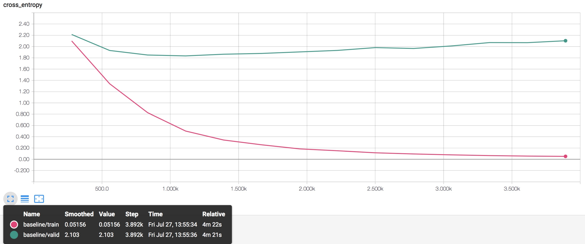

精度曲线

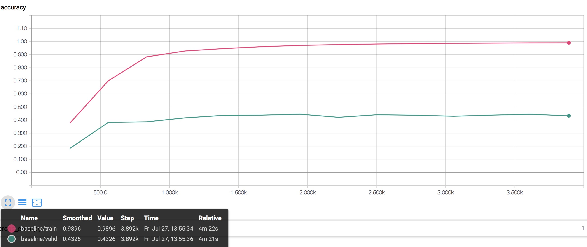

在这个数据集下，这个基准神经网络从零开始训练时，存在严重的过拟合现象，没有学到有效的信息（例如关注点可能在驾驶员的衣服）。验证集上的损失与训练集上的损失、基准阈值等都有很大的差距。一些简单的对付过拟合方法很难补上如此大的性能差距，例如dropout、L2正则化等。对抗过拟合，一种方式是数据增广，但是从零开始训练这样的一个网络，需要的数据量可能在百万级以上，需要的计算时间也显著增长。在数据增广的过程中，不仅要增加多样性，同时必须要保证与原始数据符合同分布。需要增广的数据量越大，这些要求的难度越大。

#### 迁移学习

一种简单有效的方式是迁移学习，利用在其他任务上学习到的能力（例如对于边缘、人物外形的检测能力），帮助新的学习任务。进行迁移学习时，需要考虑2个问题：1. 新任务与原始任务是否具有较强的相似性；2. 新任务数据集的大小。对于这个问题，走神司机检测与ImageNet任务有一定的相似性，例如都需要检测到实例并进行分类，但是关于分类的依据，差别较大；同时，数据集较小。这时，可以利用预训练模型的权重，进行fine-tuning。

在最初进行迁移学习的时候，由于认识不到位，走了点弯路。没有采用fine-tuning，而是采取固化除最后一层输出层以外的所有权重，只训练最后一层权重的方式。同时考虑到减少重复计算量，首先去除最后一层，将剩下的网络作为特征提取器，提取训练、验证集的特征向量，并存储。然后利用存储的特征向量进行训练、模型选择等。采用这样的方式，10个epoch训练后，在训练、验证集上的性能均比基准神经网络略差，远远低于预期。

**fine-tuning**

在纠正思路后，利用预训练权重，进行fine-tuning。首先，在原始数据集上开展训练，调整超参数。由于计算时间较长，时间有限，没有采用交叉验证的方式，而是随机划分训练、验证集。主要调整的超参数有学习率、dropout的保留率。

**学习率**

首先调整学习率。考虑到是在预训练权重的基础上fine-tuning，学习率不能过大，否则更新步长过大，容易超出预训练提供的较好的权重范围；学习率不能过小，否则学习过慢。在三种学习率设置（1e-4, 1e-5, 1e-6）下，学习曲线对比如下

不同学习率下损失

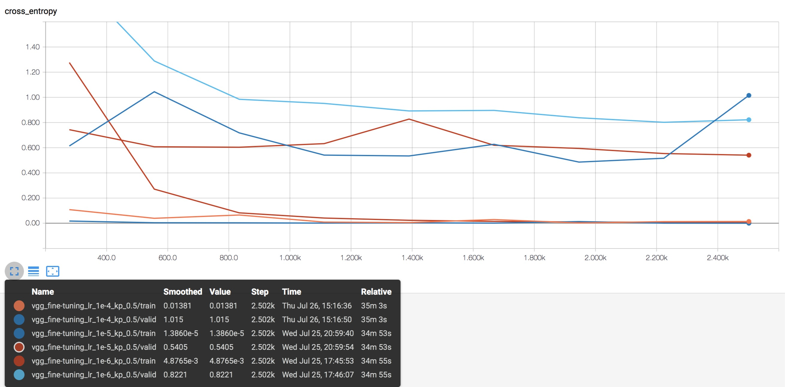

不同学习率下精度

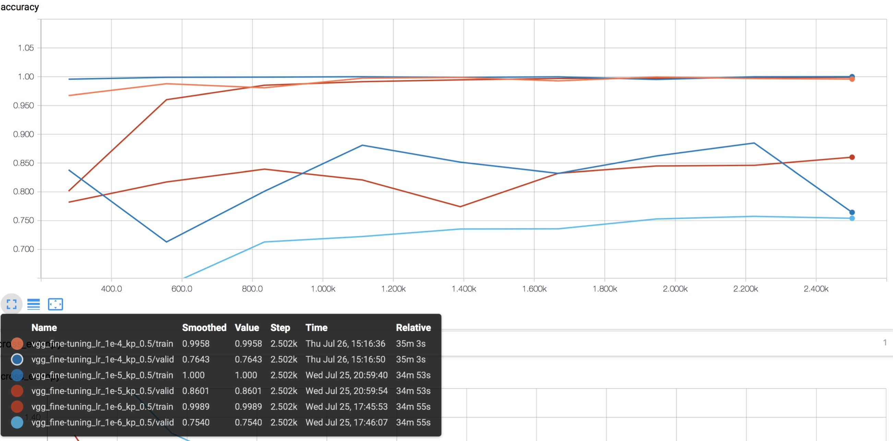

可以看到，1e-4的学习率，对于这个迁移学习问题还是过大，容易丢失预训练权重，损失下降情况不太理想，容易震荡，甚至发散；1e-6的学习率太小，损失下降过程比较缓慢；1e-5的学习率是比较合适的。

**dropout保留率**

然后调整dropout的保留率。考虑到数据集较小，存在较大的过拟合风险，因此需要dropout。在三种保留率设置下，学习曲线对比如下

不同保留率下损失


不同保留率下精度

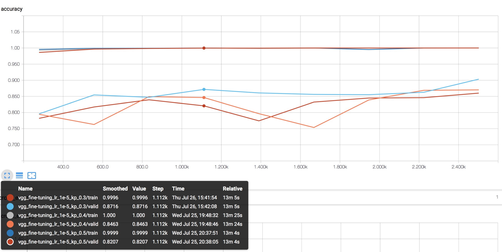

可以看到，保留率为0.3和0.4的时候，过拟合较小，性能较好。

经过超参数调整和fine-tuning，模型在验证集上的性能有了较大提升。在学习率为1e-5，保留率为0.4的情况下，10个epoch的训练后，在验证集上的损失为0.3972，精度为87.01%，此时在训练集上的损失为0.0001，精度为100%，仍然存在一定程度的过拟合。在全体数据集上训练后，在kaggle leaderboard上的得分，public为0.56464， private为0.50486，可以看到在这个验证集上的损失能够较好地反映在private测试集上的损失，具有较好的参考意义。private得分排在321名（实际上比赛已经截止，仅作参考），占全体的22.3%。

在学习率为1e-5，保留率为0.3的情况下，10个epoch的训练后，在验证集上的损失为0.3565，精度为90.33%，此时在训练集上的损失为0.0002，精度为99.99%，仍然存在一定程度的过拟合。在全体数据集上训练后，在kaggle leaderboard上的得分，public为0.51033， private为0.54968，可以看到在这个验证集上的损失能够较好地反映在private测试集上的损失，具有较好的参考意义。private得分排在345名，占全体的23.95%。

**L2正则化**

考虑到仍然存在较为明显的过拟合现象，在学习率为1e-5，保留率为0.3的基础上，尝试L2正则化，选取正则化项的scale参数为[0.005, 0.01, 0.03, 0.05, 0.1, 0.3, 0.5]。结果如下：

交叉熵损失


正则化损失

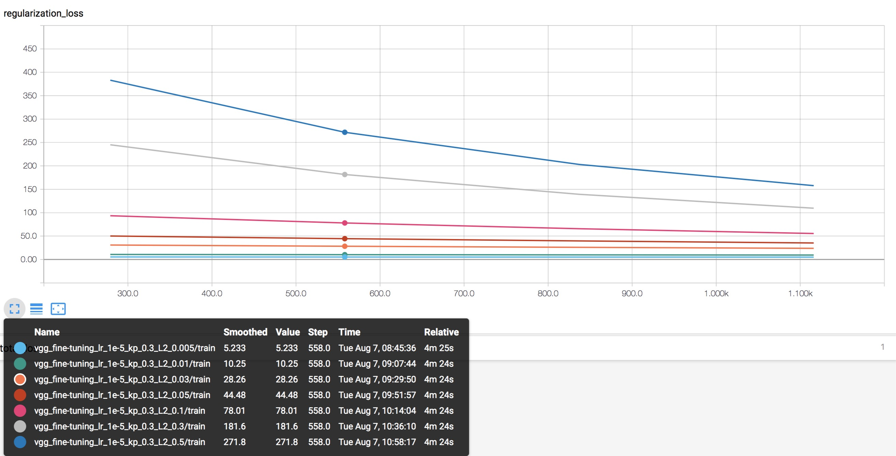

精度

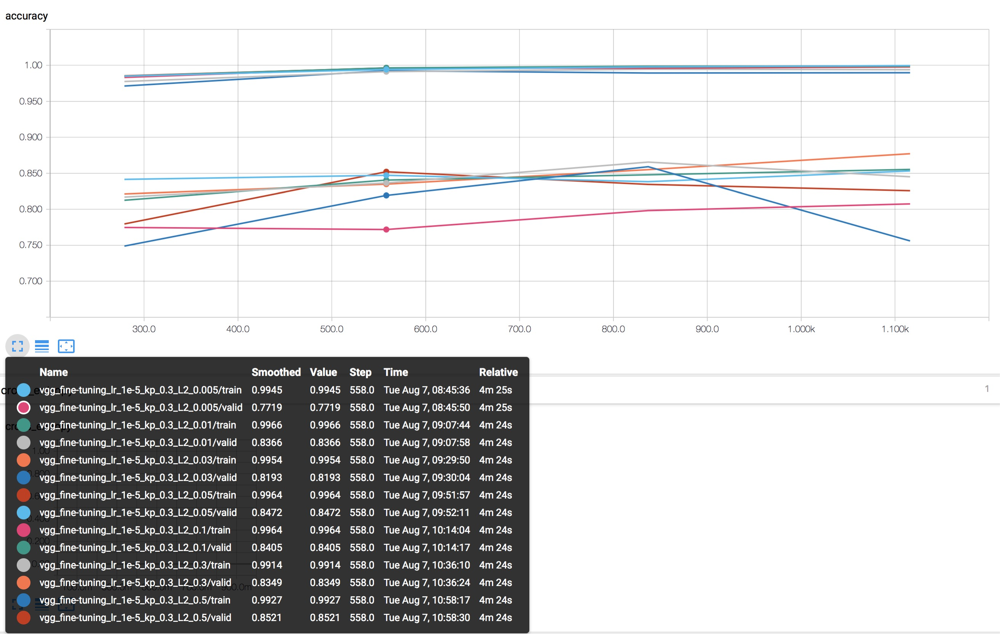

可以看到，L2正则化效果并不显著，训练集损失接近0，过拟合仍然比较严重；并且随着scale参数的进一步增大，训练集上的损失也有发散的趋势。相对而言，可以选scale=0.3。原始数据决定了算法性能的上限，算法的优化调整只能逼近这个上限。因此，最有效的方式还是从数据本身入手，一种可能的办法是将同类图像左右拼接方法进一步推广到Mixup样本混合方法[5]，进一步增强数据多样性。

**最终选择的超参数**

因此，选取2组超参数，学习率为1e-5，保留率分别为0.3和0.4，scale=0.3。另外，为了进一步防止过拟合，采取early stopping机制，总共训练10个epoch，在训练中记录最小的验证集损失及其对应的训练模型，当最小损失在连续3个epoch中都没有更新时，中止训练，并使用之前记录的模型进行预测。

在5折交叉验证下，以**原始数据，学习率1e-5，保留率0.3，scale=0.3**为例，

交叉熵损失


正则化损失


精度


可以看到，在所有情况下都出现了early stopping，并且仍然存在过拟合的问题。由于L2正则化，初始阶段的过拟合现象相比没有正则化时稍弱。注意到正则项损失始终持续下降，但是训练集上交叉熵损失先减小后有增大的趋势。解决这一问题，可能需要scale参数进行退火处理。考虑到损失函数与权重的关系，简化后可以给出一个直观的类比解释。假设权重是标量$$w$$，交叉熵损失是权重的高阶函数，例如$$w^3$$，正则化损失应该为$$\lambda w^2$$，即总的损失函数为

$$E(w) = w^3 + \lambda w^2$$

当$$\lambda$$取值合适，并且权重初始化合理时，两项的梯度$$3w^2$$和$$2\lambda w$$量级相当，两项损失都能得到合理的优化。随着优化进行，当$$w<<2\lambda/3$$时，交叉熵损失的梯度与正则化损失相比几乎可以不计，难以得到进一步优化。一种可能的方式是对$$\lambda$$进行退火处理，保证两项损失的梯度在同等量级。由于时间关系，这个问题留待以后解决。

由前面的数据探索可知，原始训练集较小，相关性较大，信息冗余较大。在迁移学习的基础上，做数据增广，达到同样的性能，所需要的额外数据量应该比从零开始训练少的多。换句话说，在此基础上做数据增广，可能比较有效且更有效率。在增广后的数据集上开展fine-tuning，理论上需要重新微调超参数，以优化性能。为了便于对比，增广后的数据集进行划分时，增广的图片只出现在训练集中，与验证集具有相同驾驶员标签的增广数据直接剔除。

以**增广数据，学习率1e-5，保留率0.3，scale=0.3**为例，结果如下

交叉熵损失


正则化损失


精度


可以看到，就单个模型而言，仍然存在过拟合；但不同模型之间性能相当又有明显差异，这为集成学习提供了条件。在此基础上，可以将多个模型的预测结果以平均的方式bagging集成，能够减小过拟合。

## IV. 结果

### 模型的评价与验证
将在不同fold上训练的、采用不同保留率、有无数据增广的模型及其集成模型的预测结果提交Kaggle，在public和private上的得分如下：

**括号内为采用L2正则化和early stopping的得分，括号外为没有采用L2正则化和early stopping的得分**

| 学习率   | 数据增广  | 保留率      | fold          | public得分              | private得分             | 备注                                                |
| -------- | --------- | ----------- | ------------- | ----------------------- | ----------------------- | --------------------------------------------------- |
| 1e-5     | 无        | 0.3         | 1             | 0.79698（ 0.47544）     | 0.56839（ 0.49888）     |                                                     |
| 1e-5     | 无        | 0.3         | 2             | 0.82204（ 0.46111）     | 0.63943（ 0.44511）     |                                                     |
| 1e-5     | 无        | 0.3         | 3             | 0.92259（ 0.50770）     | 0.78349（ 0.49916）     |                                                     |
| 1e-5     | 无        | 0.3         | 4             | 0.55682（ 0.49640）     | 0.53778（ 0.49802）     |                                                     |
| 1e-5     | 无        | 0.3         | 5             | 0.66537（ 0.53593）     | 0.57690（ 0.46846）     |                                                     |
| **1e-5** | **无**    | **0.3**     | **1+2+3+4+5** | **0.44990（ 0.38315）** | **0.34335（ 0.35216）** | **集成5个fold**                                     |
| 1e-5     | 无        | 0.4         | 1             | 0.89202（ 0.51925）     | 0.66112（ 0.47300）     |                                                     |
| 1e-5     | 无        | 0.4         | 2             | 0.74859（ 0.44403）     | 0.70906（ 0.46743）     |                                                     |
| 1e-5     | 无        | 0.4         | 3             | 0.78063（ 0.49540）     | 0.70665（ 0.55805）     |                                                     |
| 1e-5     | 无        | 0.4         | 4             | 0.65938（ 0.44406）     | 0.62003（ 0.45044）     |                                                     |
| 1e-5     | 无        | 0.4         | 5             | 0.65239（ 0.52648）     | 0.56955（ 0.53890）     |                                                     |
| **1e-5** | **无**    | **0.4**     | **1+2+3+4+5** | **0.39564（ 0.38604）** | **0.33269（ 0.37587）** | **集成5个fold**                                     |
| **1e-5** | **无**    | **0.3+0.4** | **1+2+3+4+5** | **0.38638（ 0.36986）** | **0.31592（ 0.35313）** | **无数据增广，集成5个fold，并且集成保留率0.3和0.4** |
| 1e-5     | 有        | 0.3         | 1             | 0.83787（ 0.51309）     | 0.87342（ 0.46629）     |                                                     |
| 1e-5     | 有        | 0.3         | 2             | 0.60111（ 0.63154）     | 0.66109（ 0.60777）     |                                                     |
| 1e-5     | 有        | 0.3         | 3             | 0.71145（ 0.36854）     | 0.67885（ 0.43297）     |                                                     |
| 1e-5     | 有        | 0.3         | 4             | 0.63115（ 0.52071）     | 0.68218（ 0.50284）     |                                                     |
| 1e-5     | 有        | 0.3         | 5             | 0.57543（ 0.58596）     | 0.71881（ 0.65267）     |                                                     |
| **1e-5** | **有**    | **0.3**     | **1+2+3+4+5** | **0.31576（ 0.37980）** | **0.35691（ 0.36591）** | **集成5个fold**                                     |
| 1e-5     | 有        | 0.4         | 1             | 0.78513（ 0.47980）     | 0.80706（ 0.41035）     |                                                     |
| 1e-5     | 有        | 0.4         | 2             | 0.80381（ 0.54585）     | 0.84161（ 0.48482）     |                                                     |
| 1e-5     | 有        | 0.4         | 3             | 0.62122（ 0.43876）     | 0.79408（ 0.50536）     |                                                     |
| 1e-5     | 有        | 0.4         | 4             | 0.59064（ 0.43100）     | 0.57482（ 0.41569）     |                                                     |
| 1e-5     | 有        | 0.4         | 5             | 0.56818（ 0.52240）     | 0.63961（ 0.57918）     |                                                     |
| **1e-5** | **有**    | **0.4**     | **1+2+3+4+5** | **0.34860（ 0.36569）** | **0.37446（ 0.37416）** | **集成5个fold**                                     |
| **1e-5** | **有**    | **0.3+0.4** | **1+2+3+4+5** | **0.30194（ 0.35973）** | **0.32872（ 0.35727）** | **有数据增广，集成5个fold，并且集成保留率0.3和0.4** |
| **1e-5** | **无+有** | **0.3+0.4** | **1+2+3+4+5** | **0.32046（ 0.35868）** | **0.29960（ 0.34936）** | **所有单个模型总集成**                              |

可见相对于每个fold上的性能，集成学习的提升十分明显。采用L2正则化和early stopping后，每一个单模型的性能提升都十分显著，但是最后集成模型的性能反而比没有正则化的要低。可能的原因是正则化的引入导致模型间的多样性降低，不能实现更好的优势互补。集成学习要求弱学习器“好而不同”，才能实现优势互补。最终选择的模型是未采用正则化和early stopping的模型中最后一个，即所有单个模型的总集成，共集成了5*4=20个模型，在kaggle leaderboard上的得分，public为0.32046， private为0.29960，private得分排在194名，占全体的13.4%。

最终的模型应该是合理的，小于预期的基准阈值。经过实验调整后的各种参数虽然不是最优，但仍然是合理的，参数范围、网络输出等符合神经网络的规律。

模型对这个问题具有一定的鲁棒性。训练集和验证集是存在微小的差异的，验证集与测试集（public、private）也是存在差异的。虽然在训练集上仍然有一定的过拟合，但是模型在验证集、测试集（public、private）上的性能是相对一致的，具有良好的性能，说明其泛化能力较好，鲁棒性较好。

模型得出的结果是可信的，因为经过了多组对比实验，以及在测试集（public、private）上进行了测试。

### 合理性分析
前面设定的基准阈值是private leaderboard的前15%，也就是logloss小于 0.32701。最终模型在private测试集上的logloss为0.2996，优于基准阈值。对于最终模型得到的结果，在前面部分中已经进行了分析和讨论。进一步改进有待后续完成。目前，最终结果一定程度上解决了问题，因为在private测试集上logloss较小，具有一定的性能，但是距离优异的性能还有一定差距。


## V. 项目结论
### 结果可视化
可视化结果已在上述各部分展现。


### 对项目的思考
项目流程：

1. 对原始数据集进行了探索和整理，通过计算统计量、可视化等方式，发现了数据集的一些问题和特点，并针对这些问题、特点对搭建、训练、选择模型等过程的影响，进行了一些分析。
2. 搭建简单的基准神经网络，使用原始数据集，划分训练/验证集，调整超参数，分析性能和存在的问题。
3. 利用VGG-16模型开展迁移学习，使用原始数据集，划分训练/验证集，在预训练权重的基础上开展fine-tuning，调整超参数，分析性能和存在的问题。选择较好的超参数组合，以5折交叉验证的方式进行训练，并分析性能。
4. 在观察分析的基础上，对原始数据集进行增广，主要是采用左右拼接合成图像的方式，并对增广后的数据集进行相应的统计、可视化和整理。
5. 使用增广的数据集，以5折交叉验证的方式，对VGG-16模型进行fine-tuning。
6. 对上述多个模型，采用bagging集成学习，对预测结果进行平均。
7. 分析比较模型的性能，并对结果进行可视化、分析。


项目有意思的地方：

- 数据集的特点、问题很关键。让人充分认识到数据的重要性。干净、有效、全面又充分的数据集，能够从根本上极大地提升性能的上限。当这些条件不满足时，需要针对数据的特点、问题，开展相应的数据处理工作，比如筛选、划分、增广等。
- 在数据质量和数量不佳时，迁移学习是一个十分管用的工具。但是在应用迁移学习时，首先要针对人物类型、数据量大小作出相应的分析。
- 集成学习对于性能提升有较大帮助。


项目困难的地方：

- TensorFLow的熟练使用仍有困难，包含的API太多，文档不够系统。
- 如果涉及到数据增广以及大网络的训练，对于计算资源要求较大。每一次计算，耗时较多，在这种情况下如何高效调试是个问题。


最终模型和结果距离优异性能还有一定的距离，考虑到计算资源和时间限制，有待后续进一步改进。对于图像分类这一类问题，仍然需要针对不同的任务分析其特点，例如不同的分类依据决定了网络需要关注不同的热点区域，不太好实现通用的图像分类器。


### 需要作出的改进
现阶段，仍然存在较大的过拟合问题，在训练集上基本已经没有提升空间，但是验证集甚至测试集上的性能与训练集上仍有一定差距。为了解决过拟合，首先尝试了数据增强，但是效果不理想。我们也可以组合多个模型，例如使用Inception进行fine-tuning或者ResNet进行fine-tuning，然后组合。另一方面，超参数的调整也具有重要意义。

后续打算实践的算法和技术有集成学习和class activation mapping (CAM)。通过CAM，可以可视化神经网络对于每个类别关注的区域，便于算法的调试。

以最终模型作为新的基准，存在更好的解决方案，集成学习是一个方向。


# 参考文献

[1] K. Simonyan and A. Zisserman. Very deep convolutional networks for large-scale image recognition. In ICLR, 2015. 

[2] Singh K K, Lee Y J. Hide-and-seek: Forcing a network to be meticulous for weakly-supervised object and action localization. In ICCV, 2017.

[3] Zhou B, Khosla A, Lapedriza A, et al. Learning deep features for discriminative localization. In CVPR, 2016.

[4] Srivastava N, Hinton G, Krizhevsky A, et al. Dropout: a simple way to prevent neural networks from overfitting[J]. The Journal of Machine Learning Research, 2014, 15(1): 1929-1958.

[5] Zhang H, Cisse M, Dauphin Y N, et al. mixup: Beyond empirical risk minimization[J]. arXiv preprint arXiv:1710.09412, 2017.